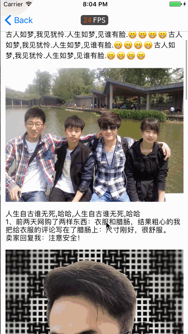

# TopicDetail
话题详情,不用webView,这里用YYLabel作图文混排

### 为什么用图文混排不用webView呢
个人认为,这个看还是要看需求的,如果界面内容比较少的话,还是用图文混排比较好点,在用webView的时候在加载webView的需要耗费一些时间,加载速度慢,影响用户体验
测试数据cell 以后自己随便放什么都行,一般都是评论-_-,这里就不说了,很简单,关于图文混排可以看YYText,里面有中文文档,很容易上手😁

### 效果图

